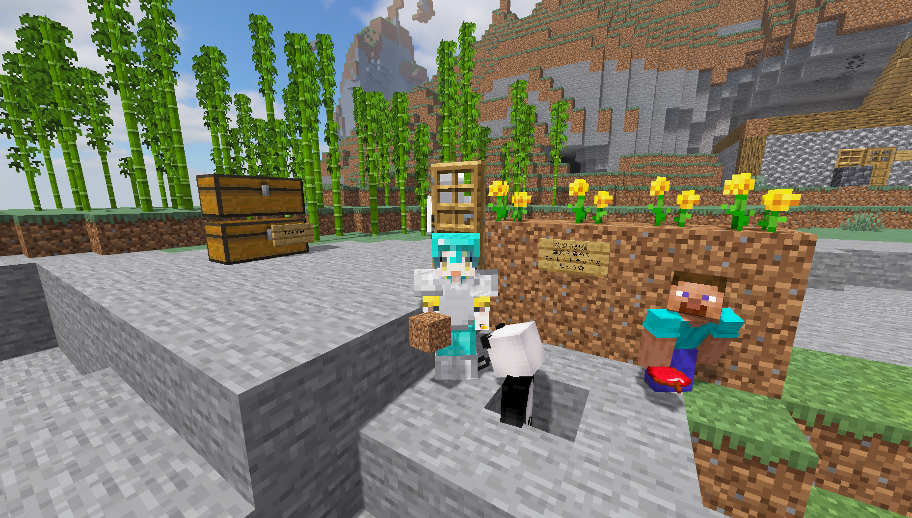

# Welcome to the Hasunoko World !

※ For Java Edition players, we recommend using [Optifine](https://optifine.net/downloads).

## 🥒 Server Specifications

Even if accessed with the Bedrock version, this server will work with the Java version of the specification.

- The server is operational 24/7, but automatic restarts occur at 05:00 and 17:00 JST.
- Please access using the latest version.
- When accessing through the Bedrock Edition, "BE\_" is prefixed to the name.
- Even if accessed through the Bedrock Edition, this server will operate based on the Java Edition specifications.
- Some aspects may behave differently from the standard Java Edition.
- The maximum `view-distance` is 16 chunks, and the maximum `simulation-distance` is 8 chunks.

## 🥒 Contents

- [1. 🥒 Rules](./1-rules.md)
- [2. 🥒 How to Join from Minecraft on Bedrock Edition](./2-switch.md)
- [3. 🥒 How to sign in Minecraft](./3-join.md)

NOTE: I'm using translation machines.

