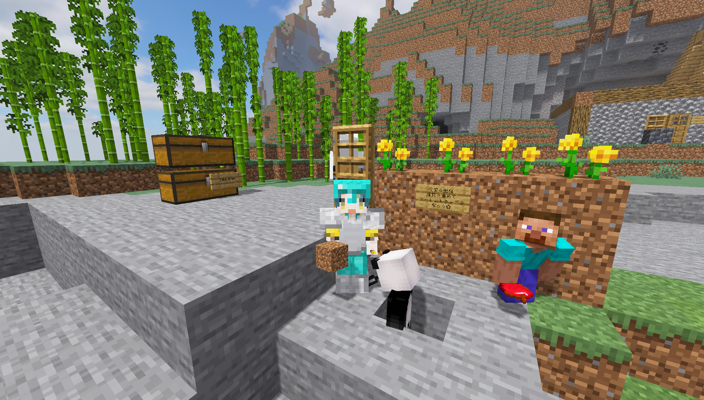

# ようこそ、はすのこわーるどへ！

※ Java 版のみなさまには [Optifine](https://optifine.net/downloads) の利用を推奨しています。

## 🥒 仕様

- 24時間稼働していますが、05:00、17:00 に自動的に再起動がかかります。
- 最新版でのアクセスをお願いします。
- 統合版でアクセスすると、名前の頭に「BE_」が付与されます。
- 統合版でアクセスしても、このサーバでは Java 版の仕様で動作します。
- 一部、Java 版でも通常とは異なる動作をする場合があります。
- 描画距離の上限は 16 チャンク、演算距離の上限は 8 チャンクです。

## 🥒 目次

- [1. 🥒 ルール](./1-rules.md)
- [2. 🥒 統合版マイクラからの参加方法](./2-switch.md)
- [3. 🥒 ログイン方法](./3-join.md)

